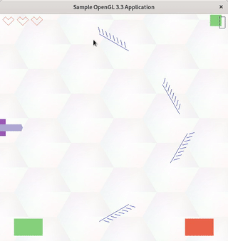

Graphics Assignment 1
=====================

Brick Breaker 2D game in OpenGL 3. More details in [the statement pdf](Assign1.pdf)

Has zoom/pan using a 2D Camera, a laser reflecting from mirrors and baskets collecting falling squares.

Megh Parikh - 201501184
=======================

Controls
--------

- CTRL + LEFT - Move red basket left
- CTRL + RIGHT - Move red basket right
- ALT + LEFT - Move green basket left
- ALT + RIGHT - Move green basket right
- Mousewheel - Zoom
- Arrow keys / Mouse drag - Pan (when zoomed)
- N/M - Decrease/Increase game speed
- A/D - Rotate cannon up/down
- E - Toggle between mouse cursor follow mode for cannon rotation or keyboard input
- S/F - Move cannon up/down
- Space - Shoot Laser
- P - Pause/Play

Extra features
--------------

- Nice cool background made of hexagons
- Background music
- Moving mirror
- 3 Lifes
- Laser is a beam
- Cannon can point towards mouse cursor
- Score and Life counter
- Zooming/panning using both mouse and keyboard
- Modular codebase

Scoring
-------
- Shooting a black brick = +2
- Shooting a red/green brick = -1
- Collecting the correct brick in a basket (red in red/green in green) = +2
- Collecting incorrect brick in basket = -1
- Collecting black brick in basket = -1 life and -1 point

License
-------
The MIT License https://meghprkh.mit-license.org/

Copyright &copy; 2017 Megh Parikh <meghprkh@gmail.com>

Music Credits: Eric Matyas (http://www.soundimage.org)
